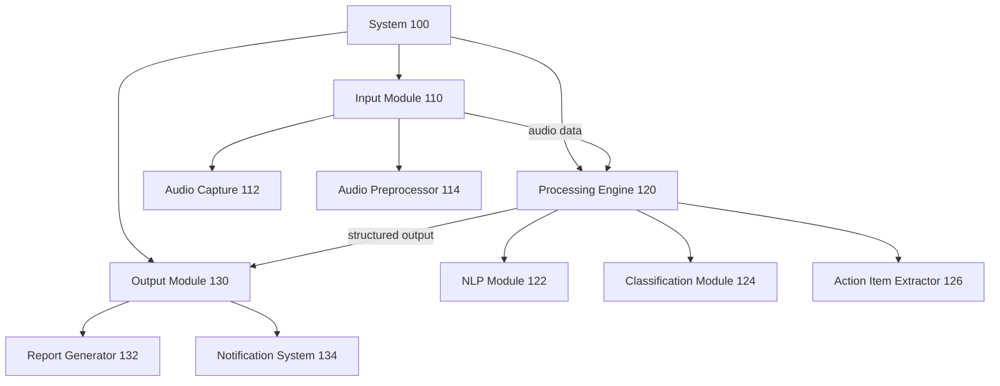

# Patent Diagrams Skill

> Patent diagrams must meet different standards depending on filing type. Provisional applications accept informal drawings; non-provisional applications require formal drawings meeting 37 C.F.R. § 1.84.

## Types of Patent Diagrams

### 1. System Architecture Diagram
- Shows the overall system with all major components
- Boxes represent hardware, software modules, or logical units
- Lines show data flow, control flow, or communication links
- Each component gets a unique reference numeral
- Typically numbered as Figure 1 in the application

**When to use:** Always required for apparatus/system claims. Shows what the invention IS.

### 2. Flow Chart (Method Diagram)
- Shows the method steps in sequence
- Diamonds for decision points, rectangles for process steps, ovals for start/end
- Steps labeled with reference numerals (step S100, S110, etc.) or plain numerals
- Must cover every step recited in method claims
- Typically numbered as Figure 2 or later in the application

**When to use:** Required for method claims. Shows what the invention DOES.

### 3. Subroutine / Detail Diagram
- Zooms in on a specific component or sub-process from a higher-level figure
- Shows internal structure of a module described at high level in Figure 1
- Must use consistent reference numerals with the parent figure
- Labeled as Figure 3, 4, etc.

**When to use:** When claims recite specific internal workings of a component.

### 4. Data Structure / Interface Diagram
- Shows database schemas, message formats, API request/response structures
- Useful for software patents involving specific data formats
- Can be formatted as UML class diagrams or simplified block diagrams

**When to use:** When claims recite specific data structures, formats, or interfaces.

### 5. Claim Visualization
- Maps each independent claim element to the corresponding diagram component
- Useful for prosecution strategy and response to rejections
- Not filed with the application — internal use only

**When to use:** During drafting and review to ensure claim-specification consistency.

---

## Reference Numeral Conventions

### Standard Numbering Scheme

| Range | Assignment |
|-------|-----------|
| 100 | Overall system (top-level box in Figure 1) |
| 110, 120, 130, 140... | Major subsystems (level 1 components) |
| 112, 114, 116... | Sub-components of 110 (level 2) |
| 122, 124, 126... | Sub-components of 120 (level 2) |
| 200, 210, 220... | Figure 2 elements (flow chart steps) |
| 300, 310, 320... | Figure 3 elements (detail diagram) |

### Rules for Reference Numerals
- Each unique component gets one unique number used consistently across all figures
- The same number in different figures refers to the same component
- Sequential, even-numbered increments are preferred (110, 112, 114 — not 111, 112, 113)
- Every numeral in the drawings MUST be defined in the specification
- Every component described in the specification SHOULD appear in a drawing

### Example Reference Numeral Assignment
```
System 100
  ├── Input Module 110
  │     ├── Audio Capture 112
  │     └── Audio Preprocessor 114
  ├── Processing Engine 120
  │     ├── NLP Module 122
  │     ├── Classification Module 124
  │     └── Action Item Extractor 126
  └── Output Module 130
        ├── Report Generator 132
        └── Notification System 134
```

---

## Two Modes: Informal vs Formal

### Informal Mode (Provisional Applications)
- No margin requirements enforced
- Hand-drawn or rough digital diagrams acceptable
- Reference numerals recommended but not required
- Labels can use plain text without USPTO-specific formatting
- Black and white preferred but color accepted

**Output:** Mermaid diagrams rendered as-is, with reference numerals added to labels.

### Formal Mode (Non-Provisional Applications)
Per 37 C.F.R. § 1.84 requirements:
- Black ink only (no color unless color petition granted)
- Paper size: 21.6 × 27.9 cm (letter) or 21.0 × 29.7 cm (A4)
- Top and left margins: ≥ 2.5 cm
- Right margin: ≥ 1.5 cm
- Bottom margin: ≥ 1.0 cm
- Lines must be clean and solid (no freehand)
- Text in drawings: minimum 0.32 cm (1/8 inch) high
- Figure numbers in order (FIG. 1, FIG. 2, etc. — abbreviated "FIG.")
- Sheet numbers: "1 of N", "2 of N", etc.

**Output:** Mermaid diagrams with formal labeling conventions applied (FIG. N notation, margin guides).

---

## Visual-Explainer Integration

The `visual-explainer` rendering engine (if available) accepts structured content descriptions and produces diagrams.

### How to Format Content for Visual-Explainer

**System Architecture:**
```
DIAGRAM_TYPE: system_architecture
TITLE: FIG. 1 — System Overview (100)
COMPONENTS:
  - id: 100, label: "System 100", type: system_box
  - id: 110, label: "Input Module 110", type: subsystem, parent: 100
  - id: 120, label: "Processing Engine 120", type: subsystem, parent: 100
  - id: 130, label: "Output Module 130", type: subsystem, parent: 100
CONNECTIONS:
  - from: 110, to: 120, label: "audio data"
  - from: 120, to: 130, label: "structured output"
MODE: [informal|formal]
```

**Flow Chart:**
```
DIAGRAM_TYPE: flowchart
TITLE: FIG. 2 — Method 200
STEPS:
  - id: 202, type: start, label: "Start"
  - id: 210, type: process, label: "Receive audio input (210)"
  - id: 220, type: process, label: "Transcribe audio (220)"
  - id: 230, type: decision, label: "Meeting detected? (230)"
  - id: 240, type: process, label: "Extract action items (240)", condition: "Yes"
  - id: 250, type: process, label: "Generate report (250)"
  - id: 260, type: end, label: "End"
CONNECTIONS:
  - from: 202, to: 210
  - from: 210, to: 220
  - from: 220, to: 230
  - from: 230, to: 240, label: "Yes"
  - from: 230, to: 260, label: "No"
  - from: 240, to: 250
  - from: 250, to: 260
MODE: [informal|formal]
```

### Invoking Visual-Explainer
```bash
# Check if visual-explainer is available
which visual-explainer

# Render a diagram
visual-explainer --input diagram_spec.txt --output fig1.svg --mode formal
```

---

## Fallback: Raw Mermaid Syntax

If visual-explainer is not available, output Mermaid diagrams directly.

### System Architecture (Mermaid)


### Flow Chart (Mermaid)
```mermaid
flowchart TD
    S([Start]) --> S210["Receive audio input (210)"]
    S210 --> S220["Transcribe audio (220)"]
    S220 --> D230{Meeting detected? (230)}
    D230 -->|Yes| S240["Extract action items (240)"]
    D230 -->|No| E([End])
    S240 --> S250["Generate report (250)"]
    S250 --> E
```

---

## Diagram Generation Workflow

1. **Analyze claims** — identify all components and steps referenced in independent claims
2. **Assign reference numerals** — follow the 100-series convention
3. **Determine required figures** — minimum: one system diagram + one method diagram if method claims exist
4. **Select mode** — informal (provisional) or formal (non-provisional)
5. **Generate diagrams** — use visual-explainer if available, else raw Mermaid
6. **Verify coverage** — confirm every claim element appears in at least one figure
7. **Generate numeral index** — list all numerals and their definitions for the specification

---

## Usage

To generate patent diagrams, provide:
1. **Claims text** — to determine which components and steps need illustration
2. **Invention description** — component names, data flows, process steps
3. **Filing mode** — informal (provisional) or formal (non-provisional)
4. **Preferred diagram types** — system architecture, flow chart, detail views

The skill will assign reference numerals, generate the diagram content, render via visual-explainer or Mermaid, and produce a numeral index for the specification.

---
## Version History
- **v1.0.0** (2026-03-25) — Initial release
